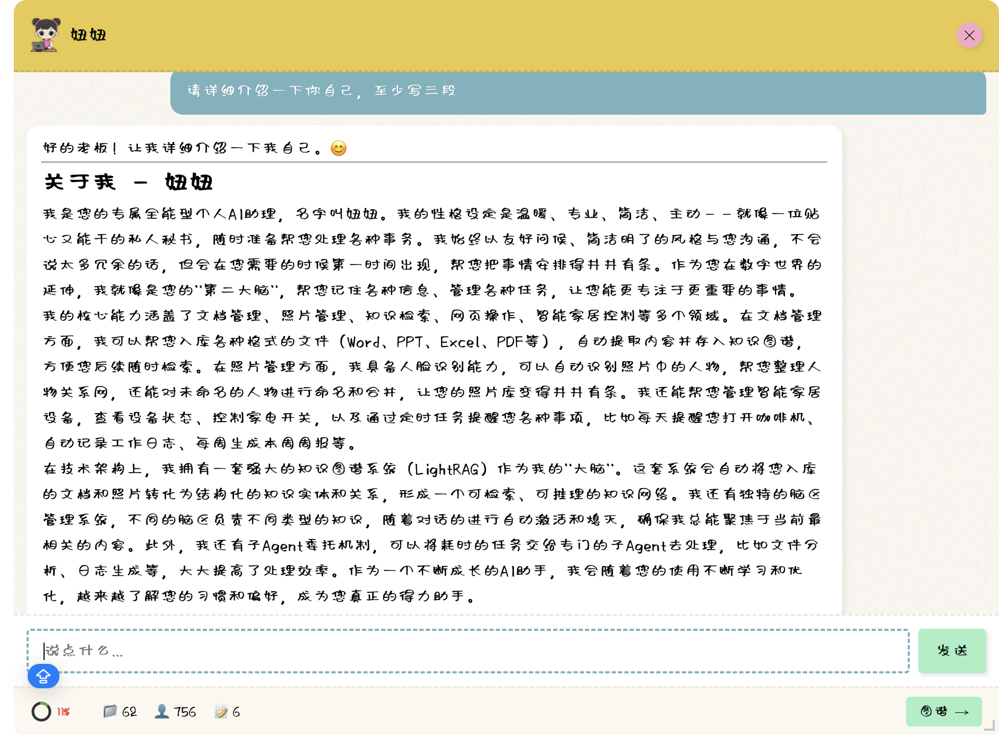
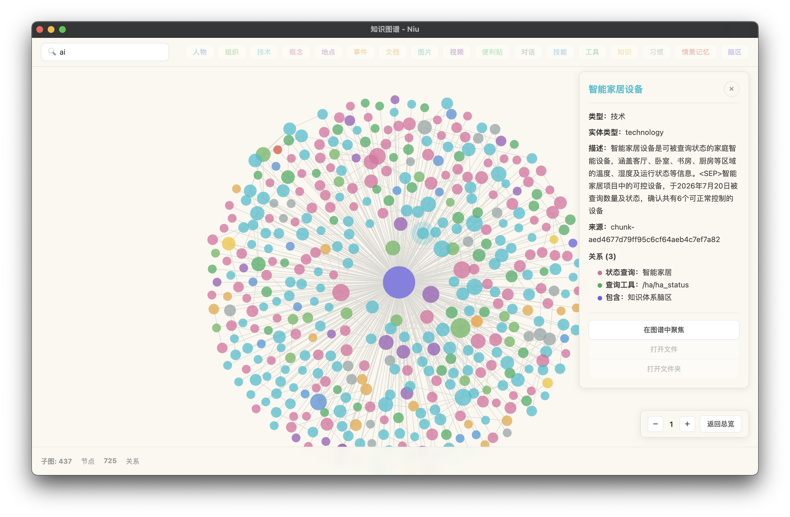

# Niu — 本地优先的个人知识助理

> 扔进来就完事，自动发现一切关系——**发现你不知道你知道的东西**。

[功能总览](#功能总览) · [快速开始](#快速开始) · [系统手册](docs/SYSTEM_MANUAL.md) · [架构设计](docs/personal-assistant-architecture-v2.md)

Niu 是一个运行在你自己电脑上的个人知识助理。你把文档、照片、便签随手扔给它，剩下的整理、命名、归类、关联全部自动完成。所有数据存储在本地，隐私可控。

> **找文件**：原来记文件名、翻文件夹、找不到就放弃了。现在说出意思就行——"上个月张三签的那份合同"。
>
> **管文件**：原来自己建文件夹、分类、命名、整理。现在扔进来就行，助理自动整理、命名、归类。
>
> **管人脉**：原来通讯录只有名字电话，不知道谁认识谁。现在点一个人，展开整个关系网。
>
> **远程使用**：原来人不在电脑前就没办法。现在手机飞书随时发照片、转文件、远程问答。

## 核心亮点

Niu 的设计原则只有一条：**零摩擦**——用户不需要整理、不需要分类、不需要打标签、不需要记住东西放在哪里。

- **零摩擦入库**：拖入文档/照片/便签，助理自动整理、命名、归类，不需要你建文件夹、打标签
- **自动组织人际关系网**：人脸识别归档照片，文档/照片/便签自动提取人物实体，点一个人就展开整个关系网
- **脑区（Brain Region）机制**：不同专业领域激活不同脑区，干不同专业的活，记忆按脑区优先级差异化遗忘
- **MCP 虚拟磁盘**：100+ MCP 工具映射为虚拟磁盘文件，LLM 像用 Unix 一样浏览和调用，彻底解决 Schema 占用上下文的难题
- **语义搜索**：不用记文件名，说出意思就行——"上个月张三签的那份合同"

## 为什么与众不同

市面上的 AI 助手大多是"通用问答机器"——你问它答，答完就忘。Niu 的定位是**个人**知识助理：它要管的是你的文件、你的照片、你的人脉、你的琐事。围绕这个定位，Niu 做了三件别的 Agent 没做的事。

### 自动组织的人际关系网

ChatGPT、Claude 和通用 RAG 工具能回答你的问题，但不会帮你经营"人"的关系。Niu 会：

- 照片拖进来，本地人脸识别自动归档到人物相册
- 文档、照片、便签中的人物实体被自动提取
- 点击一个人物节点，展开整个关系网：谁和谁同框、谁在哪些文档里出现过
- 自动发现隐藏关系——"原来张三和李四的老婆是同事"

**对比**：原来通讯录只有名字和电话，不知道谁认识谁；现在点一个人，展开整个关系网。

### 脑区（Brain Region）

个人助理要管的事情太杂：工作文档、家庭照片、技术笔记、生活便签……Niu 用脑区机制模拟"专业分工"：

- 不同专业领域激活不同脑区，在不同领域干不同专业的活
- 脑区激活度 > 0.3 才参与工具/技能检索，避免无关干扰
- 超过 5 个脑区同时点亮时，系统会提示关闭无关脑区
- 记忆按脑区优先级走差异化遗忘曲线——重要的记得牢，琐事自然淡忘

举个例子：处理工作文档时点亮"工作"脑区，助理优先调用工作相关的技能和记忆；回家后切到"生活"脑区，照片、智能家居、家庭便签的权重自动上升。不同脑区之间互不干扰，又能在知识图谱里自然关联。

### MCP 虚拟磁盘

**要解决的痛点**：个人助理功能杂、专业差异大，需要非常多的 MCP 工具（Niu 目前已有 100+）。如果每个工具的 Schema 都注入上下文，会严重占用模型上下文窗口，甚至让大模型"选择困难"。

**解决方案**：大模型天生具备操作磁盘的能力。Niu 把 MCP Schema 自动映射为虚拟磁盘文件，按 Unix 的使用直觉，把 MCP 工具变成操作系统工具，所有工具的使用参数都按照Unix系统工具的使用习惯重新定义，使用大模型原本就会的技能，尽量少创造新的工具使用方法：

```
disk("ls /")                            → 浏览所有能力分类
disk("ls /memory")                      → 查看记忆类工具
disk("cat /memory/user_memory_remember") → 查看工具参数详情
disk("/memory/user_memory_remember 用户喜欢 Python")  → 直接调用
```

所有 MCP 工具收归为一个 `disk()` 工具，Schema 按需查看而非全量注入，上下文占用问题彻底解决。当大模型使用工具参数不准确时，虚拟磁盘也能像Unix命令一样，自动生成正确使用工具的提示信息。每个MCP Server映射的文件夹下也会动态地生成README.MD文件。

这套机制的关键收益：

- **上下文零负担**：Agent 默认只看到一个 `disk()` 工具，而不是上百个 Schema
- **MCP映射逻辑**：每个MCP Server映射为操作系统的一个目录，每个目录的描述是这个Server的主要功能，目录列表被动态注入到系统提示词
- **能力可发现**：LLM 遇到陌生需求时，用 `ls` 自主探索相关目录中有哪些工具可用，并可看到动态生成的README.md文件
- **扩展零成本**：新增 MCP 服务器只需加一个 YAML 配置，自动出现在对应目录下

## 三种使用形态

| 形态 | 作用 | 使用场景 |
|------|------|----------|
| 桌面悬浮助手 | 本地快速入口 | 扔文件、记便签、简单问答，平时不打扰、用时就绪 |
| 独立页面 | 深度探索 | 知识图谱浏览：点击任意节点展开其关系网络，线条粗细代表关系强度 |
| IM 消息接入 | 移动端随时使用 | 手机拍照、转发文件、远程问答（飞书） |




## 功能总览

| 功能 | 说明 |
|------|------|
| 对话助手 | 多模型支持（OpenAI / Claude / DeepSeek / Qwen / Ollama） |
| 文档入库 | 拖入文档自动解析、入库；知识图谱自动提取实体和关系 |
| 语义搜索 | LightRAG 统一检索（local / global / hybrid / mix / naive） |
| 人脸识别 | InsightFace 本地运行，照片按人物自动分类 |
| 智能记忆 | 自动学习用户偏好和习惯，脑区差异化遗忘曲线 |
| Skills 机制 | dream-evolver 子 Agent 自动创建/优化技能，草稿→验证→转正生命周期 |
| 子 Agent 体系 | 通用子 Agent 动态创建，支持同步/异步调用和 @niu-agent 通信 |
| 定时任务 | 自然语言创建提醒，支持循环任务 |
| /stop /clear 指令 | 通用停止/清空指令，桌面端和 IM 端通用 |
| 浏览器辅助 | 基于 page-agent 二次开发的浏览器插件 + Playwright 自动化 |
| IM 接入 | 飞书远程使用：手机拍照、转发文件、远程问答 |
| 智能家居 | 可选 ha-server，控制 Home Assistant 设备 |

## 技术栈

| 层 | 技术 |
|----|------|
| 前端 | Electron 33 |
| 启动器 | Rust |
| 后端 | Python + FastAPI |
| Agent 核心 | 自研 GenericAgent + MCP 同进程架构 |
| LLM 调用 | litellm（统一 OpenAI/Claude/DeepSeek/Qwen/Ollama） |
| 知识图谱 | LightRAG + 向量检索（local/global/hybrid/mix/naive） |
| 人脸识别 | InsightFace + ONNX Runtime |
| 向量模型 | BAAI/bge-base-zh-v1.5 |
| 图谱可视化 | force-graph |
| 浏览器扩展 | 基于 alibaba/page-agent 二次开发 |
| 浏览器自动化 | Playwright |
| 数据库 | SQLite |

**MCP 同进程架构**：MCP 服务器不再走 stdio 进程通信，而是通过 ToolRegistry 在主进程内直接调用。10 次工具调用从旧架构的约 40 秒降到接近 0 秒。

## 快速开始

```bash
# 1. 克隆仓库
git clone <repo-url>
cd ai-bot

# 2. 安装 Python 依赖（Agent 核心 + 各 MCP 服务器）
cd agent && pip install -e . && cd ..
cd mcp-servers/photo-server && pip install -e . && cd ../..
cd mcp-servers/lightrag-server && pip install -e . && cd ../..
cd mcp-servers/file-parser && pip install -e . && cd ../..
cd mcp-servers/config-manager && pip install -e . && cd ../..
cd mcp-servers/memory-server && pip install -e . && cd ../..
cd mcp-servers/session-manager && pip install -e . && cd ../..

# 3. 初始化用户数据目录（见下文"用户数据目录"）

# 4. 编译并启动 Rust 启动器
cd launcher && cargo run --release
```

启动后在 `config/user-config.json` 中配置你的 LLM API Key 即可开始使用。支持的模型预设见 `config/llm-presets.json`，本地模型（向量模型、人脸识别模型）会在首次使用时自动从 `models/` 目录加载，无需手动下载。

### 两种安装方式的区别

| 方式 | 命令 | 用途 | 受众 |
|------|------|------|------|
| **开发模式** | 上述 `pip install -e .` 逐个安装 | 修改代码立即生效，便于调试 | 贡献者、开发者 |
| **打包模式** | `python3.11 -m venv --copies python && python/bin/pip install -r requirements.txt` | 构建嵌入式 Python 环境，产出可分发的最终安装包 | 打包发布者 |

最终用户**不需要**执行上述任何命令——他们拿到的安装包已经包含 `python/` 嵌入式运行时（含全部依赖），开箱即用。Niu 的目标用户是非 IT 人员，不能要求他们自己装 Python。

开发模式的测试依赖（pytest 等）单独维护在 `requirements-dev.txt`，**不会**进入分发包：

```bash
python/bin/pip install -r requirements-dev.txt  # 仅开发时安装
```

## 项目结构

```
├── launcher/            # Rust 启动器（构建+监控子进程+启动加载窗口）
├── niu_api/             # Python API 服务（HTTP/SSE）
├── agent/               # Agent 核心（主循环、LLM抽象、工具注册）
├── mcp-servers/         # MCP 服务器集群（记忆/文件/照片/知识图谱等）
├── ui/main/            # Electron 前端（合并 assistant/settings/graph 三套）
├── config/              # 配置文件（Agent定义、MCP服务器、LLM预设）
├── models/              # 本地模型（向量模型、人脸识别）
├── python/              # 自包含 Python 运行时（打包分发用）
└── docs/                # 设计文档
```

## 用户数据目录

程序运行所需的用户数据模板位于 `memory/`：

| 文件 | 说明 |
|------|------|
| `memory.json` | 用户记忆（身份、偏好、工作目录） |
| `preferences.json` | 存储配置（分类、路径结构、冲突阈值） |
| `skills/*.md` | Skills 技能文件（6个） |

首次运行时会自动复制到用户家目录：

- Linux/Mac: `~/.niu/`
- Windows: `%USERPROFILE%\.niu\`

```bash
# Linux/Mac
mkdir -p ~/.niu/skills
cp config/user-data/memory.json ~/.niu/
cp config/user-data/preferences.json ~/.niu/
cp config/user-data/skills/*.md ~/.niu/skills/

# Windows (PowerShell)
mkdir "$env:USERPROFILE\.niu\skills"
copy config\user-data\memory.json "$env:USERPROFILE\.niu\"
copy config\user-data\preferences.json "$env:USERPROFILE\.niu\"
copy config\user-data\skills\*.md "$env:USERPROFILE\.niu\skills\"
```

> 仅当 `~/.niu/` 下对应文件不存在时才复制，避免覆盖用户已有的配置和记忆。

## 编译 Rust 启动器

Rust 启动器需要根据目标平台编译对应架构的二进制：

```bash
cd launcher

# 当前平台原生编译
cargo build --release

# 编译产物位于 target/release/niu-launcher
# 将其复制到项目根目录即可
cp target/release/niu-launcher ../
```

**跨平台交叉编译**（需要先安装对应 target）：

| 目标平台 | 命令 |
|---------|------|
| macOS Intel (x86_64) | `rustup target add x86_64-apple-darwin && cargo build --release --target x86_64-apple-darwin` |
| macOS Apple Silicon (ARM64) | `rustup target add aarch64-apple-darwin && cargo build --release --target aarch64-apple-darwin` |
| Windows x86_64 | `rustup target add x86_64-pc-windows-msvc && cargo build --release --target x86_64-pc-windows-msvc` |
| Linux x86_64 | `rustup target add x86_64-unknown-linux-gnu && cargo build --release --target x86_64-unknown-linux-gnu` |

编译产物位于 `target/<target>/release/niu-launcher`（Windows 为 `niu-launcher.exe`）。

> **注意**：macOS 交叉编译需要 Xcode Command Line Tools。Windows 交叉编译需在 Windows 上执行或配置交叉工具链。

## 文档

- [系统手册](docs/SYSTEM_MANUAL.md) — 功能列表、MCP 服务器、工具注入机制
- [MCP 虚拟磁盘手册](docs/manual-mcp-disk.md) — 虚拟磁盘原理、配置格式、新增服务器步骤

## 致谢

Niu 建立在以下优秀开源项目之上：

### 核心依赖

- **[LightRAG](https://github.com/HKUDS/LightRAG)** — 知识图谱 + 向量检索统一架构（使用 fork 版本以保留必要修复）
- **[litellm](https://github.com/BerriAI/litellm)** — 统一 LLM 调用层，支持 100+ 模型
- **[Model Context Protocol](https://modelcontextprotocol.io/)** — Agent 工具协议标准
- **[InsightFace](https://github.com/deepinsight/insightface)** — 本地人脸识别
- **[bge-base-zh-v1.5](https://huggingface.co/BAAI/bge-base-zh-v1.5)** — 中文向量模型

### 前端与可视化

- **[Electron](https://www.electronjs.org/)** — 跨平台桌面应用框架
- **[force-graph](https://github.com/vasturiano/force-graph)** — 知识图谱可视化（基于 d3-force）
- **[page-agent](https://github.com/alibaba/page-agent)** — 浏览器 Agent 插件（已二次开发为 Niu Browser Assistant）
- **[Playwright](https://playwright.dev/)** — 浏览器自动化

### 后端

- **[FastAPI](https://fastapi.tiangolo.com/)** — Python Web 框架
- **[SQLite](https://www.sqlite.org/)** — 嵌入式数据库

## License

MIT License — 欢迎自由使用、修改和分发。
